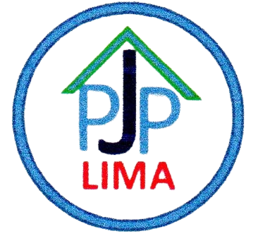

<p align="center">
  
</p>

<h1 align="center">PepejeLima — Motorcycle Rental System</h1>

<p align="center">
  A web-based motorcycle rental management system for PepejeLima, a rental business based in Yogyakarta, Indonesia.
</p>

<p align="center">
  
  
  
  
  
  
  
  
</p>

---

## 📋 Overview

**PepejeLima** is a Laravel 8 web application built for a motorcycle rental business in Yogyakarta. It streamlines the entire rental workflow — from managing motorcycle inventory and processing rentals to handling returns and generating detailed financial reports. The interface is in **Indonesian (Bahasa Indonesia)**.

---

## ✨ Features

| Feature | Description |
|---|---|
| **Motorcycle Inventory** | Full CRUD for motorcycle data — plate numbers, owner info, tax dates, purchase history, images |
| **Rental Management** | Process daily & monthly rentals with customer data, contact info, and guarantor photo uploads |
| **Return Processing** | Handle motorcycle returns with seamless status updates |
| **Motor Administration** | Track administrative tasks, expenses, and maintenance per motorcycle |
| **Role-Based Access** | User authentication with Sanctum, user type privileges, and menu-level permissions |
| **Daily Rental Report** | Generate & print daily rental activity reports |
| **Per-Vehicle Finance** | Financial breakdown report for each individual motorcycle |
| **Monthly Finance Report** | Monthly revenue and expense summaries |
| **Accumulated Report** | Year-to-date accumulated financial overview |
| **Total Per Month Report** | Compare monthly totals across the year |
| **Financial Logs** | Track all debits, credits, and kilometer logs per motorcycle |
| **PDF Export** | Print-ready PDF reports powered by DOMPDF |

---

## 🛠 Tech Stack

| Layer | Technology |
|---|---|
| **Backend** | PHP 7.3 / 8.0, Laravel 8.x |
| **Frontend** | Blade Templates, jQuery 3.7, Vanilla JS |
| **Admin Panel** | AdminLTE 3.x (Bootstrap 5.3) |
| **Database** | MySQL via Eloquent ORM |
| **Auth** | Laravel Sanctum 2.x |
| **Data Tables** | Yajra DataTables 9.x |
| **PDF Generation** | DOMPDF (barryvdh/laravel-dompdf) |
| **Form Enhancements** | Select2 4.x |
| **HTTP Client** | Guzzle 7.x |
| **Asset Bundling** | Laravel Mix 6.x, Sass |
| **Testing** | PHPUnit 9.x |

---

## 📦 Installation

### Prerequisites

- PHP ^7.3 | ^8.0
- Composer
- Node.js & npm
- MySQL database server

### Steps

1. **Clone the repository**

   ```bash
   git clone https://github.com/your-username/pepejelima.git
   cd pepejelima
   ```

2. **Install PHP dependencies**

   ```bash
   composer install
   ```

3. **Install JavaScript dependencies**

   ```bash
   npm install
   ```

4. **Configure environment**

   ```bash
   copy .env.example .env
   php artisan key:generate
   ```

5. **Set up database** — Edit `.env` with your MySQL credentials:

   ```
   DB_CONNECTION=mysql
   DB_HOST=127.0.0.1
   DB_PORT=3306
   DB_DATABASE=pepejelima
   DB_USERNAME=root
   DB_PASSWORD=
   ```

6. **Run migrations & seeders**

   ```bash
   php artisan migrate --seed
   ```

7. **Build frontend assets**

   ```bash
   npm run production
   ```

8. **Start the development server**

   ```bash
   php artisan serve
   ```

   Visit **http://localhost:8000** in your browser.

---

## 🚀 Usage

| Page | Route | Description |
|---|---|---|
| Dashboard | `/dashboard` | Overview with rental statistics and quick access |
| Motorcycle Inventory | `/master-data/master-motor` | Manage all motorcycle data (add, edit, view) |
| Rental Management | `/module-manajemen/module-sewa` | Process new rentals and view active leases |
| Return Processing | `/module-manajemen/module-kembali` | Handle motorcycle returns with status updates |
| Motor Administration | `/module-manajemen/module-administrasi-motor` | Track maintenance & admin per motorcycle |
| Daily Report | `/module-print/laporan-sewa-harian` | View & print daily rental activity |
| Per-Vehicle Finance | `/module-print/laporan-keuangan-kendaraan` | Financial report per motorcycle |
| Monthly Finance | `/module-print/laporan-keuangan-bulanan` | Monthly financial summaries |
| Accumulated Report | `/module-print/laporan-akumulasi` | Year-to-date accumulated report |
| Total Per Month | `/module-print/laporan-total-tiap-bulan` | Monthly totals comparison |

---

## 🗄 Database Schema

| Table | Purpose |
|---|---|
| `master_users` | System users with authentication credentials |
| `master_user_types` | User role definitions for access control |
| `master_motors` | Motorcycle inventory (plate, owner, tax, prices, images) |
| `master_menus` | Menu structure for the AdminLTE sidebar |
| `master_menu_privileges` | Role-based permissions per menu item |
| `module_penyewaans` | Rental transactions (customer, dates, guarantor, status) |
| `log_debits` | Debit / expense logs per motorcycle |
| `log_credits` | Credit / income logs per motorcycle |
| `log_kms` | Kilometer tracking logs per motorcycle |

---

## 📄 License

This project is open source under the [MIT License](LICENSE).
